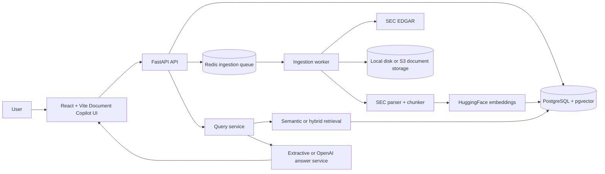
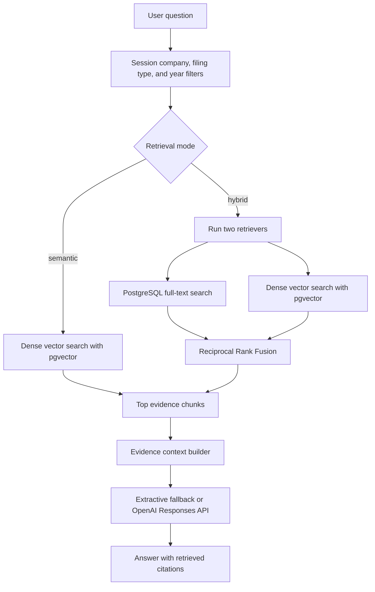
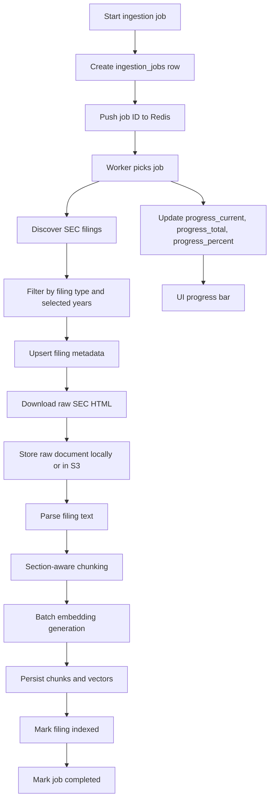

# Fintel

Fintel is a session-based SEC filing copilot. It lets a user create a research session, choose a company and filing years, ingest the relevant EDGAR filings, and then ask follow-up questions against that session with cited evidence.

The project is built as a portfolio-ready RAG application: React chat UI, FastAPI backend, async ingestion worker, PostgreSQL with pgvector, Redis, SEC EDGAR integration, local embeddings, and optional OpenAI answer synthesis.

## Current Product Flow

```text
User
  -> creates a new session in the Document Copilot UI
  -> selects or adds a company
  -> selects filing types and one or more years
  -> starts chunking and embedding
  -> watches ingestion percentage progress
  -> asks questions in the chat view
  -> asks follow-up questions in the same session
  -> receives an answer with filing citations
```

Sessions are named from the selected company and filing years, for example `Apple Inc. 2024, 2025`. Existing sessions appear in the sidebar and can be edited or deleted. Companies can also be deleted from the UI.

## System Architecture



The API and worker share the same application code. Docker Compose runs them as separate services: the API serves HTTP traffic, while the worker consumes queued ingestion jobs from Redis.

## RAG Architecture



Implemented today:

- Dense retrieval using local query embeddings and pgvector cosine distance.
- PostgreSQL full-text lexical retrieval.
- Hybrid retrieval with Reciprocal Rank Fusion.
- Metadata filtering by company, ticker, filing type, filing year, section, and filed date.
- Evidence-aware answer generation with citation metadata.
- Chat follow-up support inside the same frontend session.

Not implemented yet:

- Query expansion.
- Cross-encoder reranking.
- A separate citation verifier that checks every generated claim after answer synthesis.

## Ingestion Architecture



PostgreSQL is the durable source of truth for job state. Redis is only the queue notification layer. If the worker restarts, job state still lives in the database.

Embedding generation uses `BAAI/bge-small-en-v1.5` with 384-dimensional vectors. Chunk embedding is batched and can be tuned with:

```text
EMBEDDING_BATCH_SIZE=128
EMBEDDING_CPU_THREADS=4
```

## Data Model

PostgreSQL stores durable application state:

- `users`: registered users and hashed passwords.
- `companies`: tracked public companies.
- `filings`: SEC metadata, raw document storage key, selected form type, filing date, and indexing status.
- `filing_chunks`: parsed filing chunks with section metadata.
- `chunk_embeddings`: pgvector embeddings connected to chunks.
- `ingestion_jobs`: durable async ingestion status and progress.

Raw SEC documents are stored outside PostgreSQL. Local development uses the `data/` directory. Production can use S3 through the storage provider configuration.

## Backend Services

The backend keeps routes thin and pushes behavior into services:

- Auth and JWT handling.
- Company management.
- Filing metadata persistence.
- SEC filing discovery and download.
- Document storage abstraction.
- SEC parsing and section-aware chunking.
- Embedding generation.
- Async ingestion orchestration.
- Semantic, lexical, and hybrid retrieval.
- Grounded answer generation.

`LLM_PROVIDER=extractive` keeps local development deterministic and avoids external API cost. `LLM_PROVIDER=openai` uses the OpenAI Responses API with the retrieved evidence context.

To use OpenAI for grounded answer synthesis, set:

```text
LLM_PROVIDER=openai
OPENAI_API_KEY=...
OPENAI_MODEL=gpt-5-mini
```

The OpenAI path calls the Responses API from the server. Keep the API key in environment configuration, not in frontend code.

## Storage Provider

Local development uses `DOCUMENT_STORAGE_PROVIDER=local` and writes SEC HTML under `data/`. For AWS or another S3-compatible deployment, set:

```text
DOCUMENT_STORAGE_PROVIDER=s3
S3_BUCKET_NAME=...
S3_KEY_PREFIX=raw
S3_REGION_NAME=...
```

The ingestion services continue to use logical storage keys either way, so switching storage providers does not require parser or retrieval changes.

## Frontend

The frontend is a React/Vite chat application. It includes:

- Login and registration.
- ChatGPT-style session layout.
- Sidebar session history.
- New session setup flow.
- Company creation and deletion.
- Filing type and multi-year ingestion controls.
- Ingestion progress percentage bar.
- Session editing.
- Session deletion.
- Follow-up questions in the same chat session.
- Inline citations returned from the backend.

## Local Development

Create a `.env` from `.env.example` and set real values:

```text
DATABASE_URL=postgresql+psycopg://...
JWT_SECRET_KEY=...
SEC_USER_AGENT=Your App your-email@example.com
DEBUG=false
DOCUMENT_STORAGE_PROVIDER=local
LLM_PROVIDER=extractive
EMBEDDING_BATCH_SIZE=128
```

Run migrations:

```powershell
.\.venv\Scripts\python.exe -m alembic upgrade head
```

Run tests:

```powershell
$env:DEBUG='false'
.\.venv\Scripts\python.exe -m unittest discover -s tests
```

Run the local verification suite:

```powershell
.\scripts\verify-local.ps1
```

Start the API locally:

```powershell
.\.venv\Scripts\uvicorn.exe app.main:app --reload
```

Start the frontend locally:

```powershell
cd frontend
npm install
npm run dev
```

Then open:

```text
http://localhost:5173
```

Run the frontend smoke test:

```powershell
cd frontend
npm run test:e2e
```

## Docker Compose Demo

```powershell
docker compose up --build
```

This starts:

- Document Copilot UI on `localhost:5173`
- FastAPI API on `localhost:8000`
- ingestion worker
- PostgreSQL with pgvector
- Redis

Apply migrations inside the API container:

```powershell
docker compose run --rm api alembic upgrade head
```

Run a full Compose smoke test:

```powershell
.\scripts\compose-smoke.ps1
```

The smoke script uses the isolated Compose project name `fintel-smoke` and removes only that project's test volumes at the end.

## Important Endpoints

- `POST /auth/register`
- `POST /auth/login`
- `GET /auth/me`
- `POST /companies`
- `GET /companies`
- `DELETE /companies/{ticker}`
- `POST /filings`
- `GET /filings`
- `POST /ingestion/companies/{ticker}`
- `POST /ingestion/companies/{ticker}/jobs`
- `GET /ingestion/jobs/{job_id}`
- `POST /retrieval/semantic`
- `POST /retrieval/hybrid`
- `POST /query`

## Production Readiness

The application is close to an AWS-ready demo architecture, especially through Docker Compose. For a production release, the main remaining hardening items are:

- Use managed PostgreSQL with pgvector support.
- Use managed Redis or an equivalent queue service.
- Use S3 for raw SEC document storage.
- Store secrets in AWS Secrets Manager or SSM Parameter Store.
- Run API and worker as separate deployable services.
- Add persistent frontend hosting through S3/CloudFront, Amplify, or another static hosting target.
- Add observability for ingestion jobs, queue depth, request latency, and retrieval quality.
- Add authentication/session persistence expectations for the chosen deployment model.

The intended AWS shape is:

```text
ALB
  -> ECS Fargate API
  -> ECS Fargate worker
RDS PostgreSQL + pgvector
ElastiCache Redis
S3 for raw filings
Secrets Manager
CloudWatch
GitHub Actions
```

A cheaper recruiter-facing deployment can run the same API, worker, PostgreSQL, and Redis shape on one VM with Docker Compose.

Terraform for the AWS learning deployment lives in `infra/aws`. Treat it as a reviewable deployment blueprint and cost-check it before applying.

## Evaluation

The evaluation layer currently supports retrieval evaluation cases with:

- Recall@K
- reciprocal rank / MRR
- nDCG@K

These metrics help compare chunk sizes, overlap, embedding models, filters, hybrid retrieval, and future reranking changes with something more reliable than intuition.

## Project Guides

- [Architecture](docs/ARCHITECTURE.md)
- [API walkthrough](docs/API_WALKTHROUGH.md)
- [Deployment checklist](docs/DEPLOYMENT_CHECKLIST.md)
- [AWS infrastructure notes](infra/aws/README.md)
